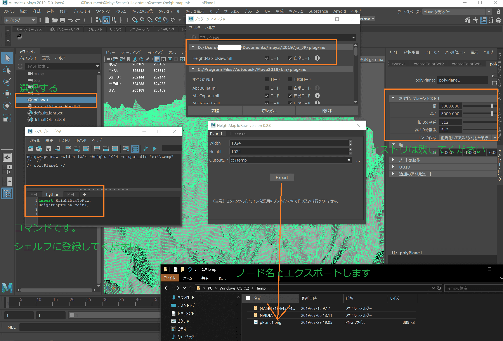

# maya_heightmap_to_raw
 MAYA plugin.

# 概要

MAYAのPlaneをHeightMap(.png)へ変換するプラグインです。

# 使い方

# 仕様

- 1頂点→1ピクセル
- MAYAの1.0の高さ　→　pngで1.0の色。(色はfloatです)

## 注意

真っ黒なpngファイルが出来がちですが、Photoshopなどで明るく調整すると分かりやすくなります。

# 連絡先

- <https://ohtorii.hatenadiary.jp/> 
- <https://twitter.com/ohtorii> 
- <https://github.com/ohtorii>
